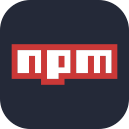

# 🌌 Crypto Cosmos

<div align="center">
  

[](https://reactjs.org/)
[](https://vitejs.dev/)
[](LICENSE)

</div>

## 📝 Overview

Crypto Cosmos is a sophisticated web application that provides real-time cryptocurrency market insights. Built with modern web technologies and powered by the CoinGecko API, it offers an intuitive interface for tracking cryptocurrency prices, market trends, and historical data.

### ✨ Key Features

- 📊 Real-time cryptocurrency price tracking
- 📈 Interactive price charts and market trends
- 🔍 Detailed cryptocurrency information and statistics
- 📱 Responsive design for all devices
- ⚡ Fast and efficient data updates
- 🌐 Integration with CoinGecko API

## 🛠️ Tech Stack

<div align="center">
   
   
   
   
   
   
   
   
  
  
  
</div>

### Core Dependencies

- React v18.3.1
- React Router DOM v7.1.1
- React Google Charts v5.2.1
- Vite v6.0.5

## 🚀 Getting Started

### Prerequisites

- Node.js (Latest LTS version recommended)
- npm or yarn package manager

### Installation

1. Clone the repository

   ```bash
   git clone https://github.com/akosikhada/crypto-cosmos.git
   ```

2. Navigate to project directory

   ```bash
   cd crypto-cosmos
   ```

3. Install dependencies

   ```bash
   npm install
   ```

4. Start the development server
   ```bash
   npm run dev
   ```

## 📁 Project Structure

```
crypto-cosmos/
├── src/
│   ├── assets/      # Static assets
│   ├── components/  # React components
│   ├── context/     # React context providers
│   ├── Home/        # Home page components
│   ├── Navbar/      # Navigation components
│   ├── Chart/       # Chart components
│   ├── Coin/        # Cryptocurrency components
│   └── Footer/      # Footer components
├── public/          # Public assets
└── package.json     # Project dependencies
```

## 🔧 Available Scripts

- `npm run dev` - Start development server
- `npm run build` - Build for production
- `npm run preview` - Preview production build
- `npm run lint` - Run ESLint

## 📫 Contributing

Contributions are welcome! Feel free to open issues and submit pull requests.

## 📄 License

This project is licensed under the MIT License - see the [LICENSE](LICENSE) file for details.

---

<div align="center">
  Made with ❤️ by <a href="https://github.com/akosikhada">akosikhada</a>
</div>
